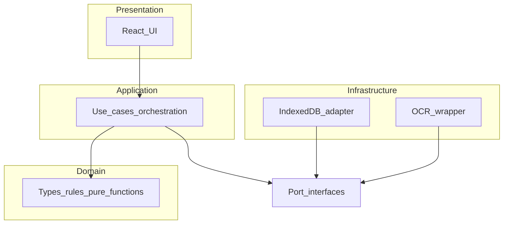
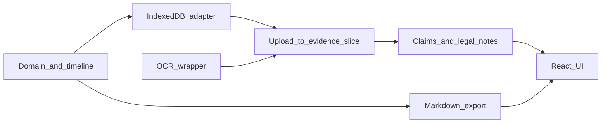

# TDD plan: Landlord Case Organizer MVP

## Source material

- [MVP design spec](../specs/landlord_case_organizer_mvp_design_spec.md)
- [Legal and engineering follow-ups / checklist](../discussions/landlord_mvp_tdd_plan_review_followups.md) — expanded themes below are merged from this doc

## Principles (non-negotiable)

Follow red–green–refactor for every behavior: **write one failing test → run and confirm the failure is for the right reason → minimal production code → run all tests → refactor while green**. No production code without a prior failing test (project TDD / red–green–refactor discipline).

Prefer **behavior-focused tests** on real modules (pure domain, storage adapter, export builder). Mock **only** boundaries that are slow or non-deterministic (e.g. Tesseract in unit tests). Add a **contract or smoke** path that exercises real OCR (or a real fixture image) so shipped behavior is not only mocks — see [Testing strategy and definition of done](#testing-strategy-and-definition-of-done).

## Architecture: loose coupling and layers

The app stays **loosely coupled** by depending on **ports** (interfaces), not concrete IndexedDB, Tesseract, or browser APIs outside infrastructure.

| Layer | Responsibility | May import from |
| ----- | ---------------- | --------------- |
| **Domain** | Entities, value objects, invariants, pure transforms (timeline, validation, categorization rules) | Standard library / self only — **no** storage, OCR, React, or browser globals |
| **Application** | Use cases / orchestration (e.g. upload → OCR → persist evidence); **defines** the ports it needs | Domain + port **types** |
| **Infrastructure** | IndexedDB adapter, Tesseract wrapper, file/blob helpers | Domain types; **implements** ports |
| **Presentation** | React UI; maps user actions to application commands; reads view models / DTOs | Application API (or a thin facade) — **not** direct `app/storage/` or `app/ocr/` |

**Dependency rule**: inner layers never depend on outer ones; **application** orchestrates via **ports**; tests inject fakes at those boundaries.

## Identity and naming (domain and UI)

**Domain and persisted data**

- Every **first-class entity** (case, evidence, claim, legal note, tag, taxonomy entry such as suggested categories, export preset if modeled) has a **stable opaque `id`** (e.g. UUID) and a **user-facing `name` / `title` / `displayName`** where the product needs human labeling.
- **Relationships use ids only** — renaming must not break links. Export and UI resolve ids to display strings at render or export time.
- **Enums / taxonomies**: model **`id` + `displayName`** (or code + label) in domain types so export, UI, and tests stay aligned.
- **Tests**: assert round-trip **ids**; add cases where **rename** does not duplicate or orphan linked entities.

**UI and product surfaces** (features, screens, flows)

Give **stable machine ids** and **display names or copy keys** to everything that constitutes navigable UI and feature behavior (one vocabulary for logs, analytics, RTL, and optional `data-testid`).

| Kind | Machine id (examples) | Human side |
| ---- | --------------------- | ---------- |
| Feature | `feature.uploadEvidence`, `feature.exportMarkdown` | In-app title / description |
| Screen | `screen.caseDashboard`, `screen.exportPreview` | Page / section title |
| Nav / tab | `nav.timeline`, `tab.claims` | Tab label |
| Action | `action.addEvidence`, `action.dismissOnboarding` | Button or menu text |
| Onboarding step | `onboarding.step.createCase`, `onboarding.step.addFirstDoc` | Step heading + body |
| Glossary | `glossary.claim`, `glossary.evidence` | Term + explainer |
| Gate | `gate.preExportAcknowledgment` | Acknowledgment copy |
| Export variant | `export.fullCase`, `export.timelineOnly` | Selector label |
| Empty / error | `empty.noEvidence`, `error.ocrFailed` | Message or i18n key |

**Guardrails**: ids cover **product-meaningful** surfaces (primary flows, gates, major states) — not every DOM node. Prefer a **single registry** (`as const` maps / typed unions under e.g. `app/product-surface/` or beside `app/application/`). RTL: prefer `getByRole` + accessible name; when `data-testid` is needed, derive values from the same constants.

## Cross-cutting themes (from review)

The roadmap optimizes for **test discipline** and **clean layering** (see [Architecture: loose coupling and layers](#architecture-loose-coupling-and-layers)) but must also explicitly cover:

1. **Legal / product risk** — what the product must not imply; how exports and OCR affect user decisions in disputes.
2. **Non-functional requirements** — security, storage evolution, browser constraints, accessibility.
3. **Release realism** — a path from heavily mocked OCR to behavior users actually get in the browser.

Address these with **owners and explicit decisions** in spec and plan, not single-line placeholders (e.g. replace “reject or migrate” with a **chosen** behavior and tests).

## Legal, privacy, and product risk (shippable gates)

Internal **product legal memo** (even if non-binding) before calling the MVP shippable: disclaimers, positioning, retention, subprocessors.

**Unauthorized practice of law and user reliance**

- UX and positioning: conspicuous **“not legal advice”**; do not imply outputs are filing-ready or substitute for a lawyer.
- Features that feel like legal analysis (claim builder, categories such as “Rent Increase,” structured legal notes) are framed as **organization aids**, not conclusions.
- Engineering guardrails: default **export footer** / in-app notices before export (test copy presence in Markdown export fixtures).

**Privilege, confidentiality, and data lifecycle**

- Document **local-first** implications: shared devices, backups, future sync, Markdown **export** (discoverability, accidental sharing).
- **Retention and deletion** expectations for MVP; user-facing honesty about what on-device delete can and cannot do.
- Distinguish **raw documents** vs **derived text** vs **user notes** in policy and, where helpful, in domain types and export sections.

**OCR accuracy and evidentiary use**

- User-facing **warnings** about OCR error rates; **always preserve originals** alongside extracted text.
- **Audit metadata** on extracted text: when extracted, which engine/version (lightweight provenance) — cover with domain/export tests.
- Do not imply extracted text is a **certified** court reproduction (copy in UI and export).

**Jurisdiction and local law**

- Landlord–tenant law is **hyper-local**: MVP is **jurisdiction-agnostic** with clear limits, or carries **jurisdiction metadata** and scoped copy — decide and test any user-visible strings / empty states accordingly.
- Timelines and “claims” language must not read as universal legal truth.

**Privacy regulation (DPIA-style)**

- Treat evidence and notes as **personal data**; consider GDPR/CCPA-style **lawful basis**, minimization, subprocessors (including future cloud or analytics).
- Trigger a **DPIA** (or equivalent) when processing sensitive categories at scale.
- Plan **breach** and **user rights** (access/delete) at MVP honesty level.

## Specification traceability and phase scope

- **Map tests to spec sections** (headings or stable anchors) so “done” is not only “tests were red first.”
- **Decompose** Phases 1, 6, and 8: each phase delivers a **narrow public API** (exported functions/hooks/components) documented in one place; avoid bundling unrelated subsystems in a single test file without boundaries.
- **Prioritize Phase 8 screens** (suggested order below); document **cut lines** for MVP vs later.
- **ADHD / focus features**: specify **WCAG** targets and **keyboard** flows, not only pure selectors/reducers — test focus order and announcements where applicable.

## MVP scope from spec (in test terms)

| MVP capability      | Primary test home                                          |
| ------------------- | ---------------------------------------------------------- |
| Upload documents    | File handling + persistence of blob metadata               |
| OCR text extraction | OCR service wrapper (mocked in unit; bridge + optional E2E) |
| Tagging             | Evidence tags + optional rule-based category suggestion    |
| Timeline builder    | Pure function: evidence → sorted timeline events           |
| Legal notes         | CRUD + links to claims/evidence (domain + storage)         |
| Claim builder       | CRUD + relations to evidence/research                      |
| Export markdown     | Deterministic Markdown from fixture `Case` graphs + legal copy |

Defer (not in MVP list): PDF/HTML export, share link, GitHub sync, schema UI editor, full image cleanup pipeline — add tests only when pulled into scope.

## Novice UX — stable surface ids (examples)

Map major UX themes to **machine ids** so RTL, snapshots, analytics, and `data-testid` (when used) stay aligned with [Identity and naming (domain and UI)](#identity-and-naming-domain-and-ui).

| Theme | Stable id(s) (examples) | Where to test |
| ----- | ------------------------- | ------------- |
| Onboarding / mental model | `onboarding.flow.firstRun`, `onboarding.step.createCase`, `onboarding.step.addFirstDoc` | Phase 8 RTL |
| Glossary | `glossary.term.claim`, `glossary.term.evidence`, `glossary.term.timeline` | Phase 8 component tests |
| First export gate | `gate.preExportAcknowledgment` | Phase 8 state + RTL |
| Tech / save clarity | `screen.settingsStorage`, `copy.localOnlyWarning` | Phase 8 RTL |
| Gentle OCR failure | `error.ocrFailed` (UI), pipeline `userMessage` code aligned in Phases 3–4 | Phase 3–4 unit |
| Photo / evidence quality | `help.photoTips`, `label.originalUpload`, `label.extractedText` | Phase 8 RTL |
| Lawyer handoff | `screen.exportPreview`, `export.sectionOrder.*` matching Markdown section ids | Phase 7–8 |
| ADHD helpers | `helper.nextBestStep`, `helper.sessionRecap` | Phase 8 reducer + RTL |

## Suggested repo layout (tests co-located or `__tests__`)

Align with the spec’s [File Structure](../specs/landlord_case_organizer_mvp_design_spec.md) and keep **domain + export + persistence testable without the UI**:

- `app/domain/` — types, validation, timeline derivation, categorization helpers (no I/O)
- `app/ports/` — TypeScript interfaces: `CaseRepository`, `OcrService`, optional `Clock`, `IdGenerator`, file picker, etc.
- `app/application/` — use cases / orchestration (upload → OCR → evidence, load/save case); depends only on domain + ports
- `app/storage/` — IndexedDB **implementation** of persistence ports
- `app/ocr/` — Tesseract **implementation** of OCR port
- `app/export/` — Markdown generators per export shape (pure; may sit at domain edge or application-facing API)
- `app/product-surface/` (or colocated constants) — stable **screen / action / flow / gate** ids + optional copy map keyed by id
- `app/components/`, `app/modules/` — React UI; wire to **application** layer, not to `storage`/`ocr` directly

Use **Vitest** + **@testing-library/react**; **fake-indexeddb** (or equivalent) for IndexedDB in Node. Document **fake-indexeddb vs real browser** gaps; if CI shims fail, add **Playwright storage smoke** as fallback.

## Implementation order (dependency-first)

Each phase is a sequence of **small tests** (one behavior per test name). Complete the full cycle per test before starting the next.

**Phase ↔ primary layer**

| Phase | Primary layer |
| ----- | ------------- |
| 0 | Tooling (all) |
| 1 | Domain (+ identity / taxonomy id+name in types) |
| 2 | Infrastructure (implements persistence **ports**) |
| 3 | Infrastructure (implements OCR **port**) |
| 4 | **Application** (orchestration; inject storage + OCR ports — no domain imports from infra) |
| 5 | Domain (pure rules; categories as **id + displayName**) |
| 6 | Domain + infrastructure via ports |
| 7 | Domain / application-facing pure export (no React) |
| 8 | Presentation (+ **product-surface** ids; optional light tests that critical ids exist) |
| 9 | End-to-end (validates wired stack) |

### Phase 0 — Test harness

- Add Vitest + RTL + jsdom; path aliases if needed.
- **First failing test**: e.g. `describe('domain smoke', () => { it('exports createEmptyCase', () => { ... }) })` so the runner is proven before domain work.

### Phase 1 — Domain model and timeline (pure, fast)

**Narrow public API**: exported factories/reducers/selectors for **Case**, **Evidence**, **Claim**, **Legal note**, **Lawyer** (optional MVP), with types matching the spec.

Cover structures from the spec: **Evidence** (`id`, `type`, `date`, `tags`, extracted text, notes, source reference); **Claim** (title, description, related evidence, related law, strength, status); **Legal note** (topic, summary, source, applies-to-case, questions, confidence).

**Identity**: **Case** and every persisted child entity has **`id` + user-facing name/title** where applicable; **tags** and taxonomy entries use **`id` + `displayName`**. **Links** (claim → evidence, note → claim) store **entity ids only** — add tests that **renaming** a case or evidence **does not** break relations.

Example tests:

- Creating a case and adding evidence updates state as specified.
- **Timeline builder**: given evidence with dates (and without), output a **chronological** list with stable tie-break (e.g. by id).
- **Tagging**: add/remove tags; validate allowed shapes (non-empty id, etc.).
- **Provenance** (if modeled here): extracted-text records include optional `extractedAt`, `engineId` / version — assert serialization shape.

### Phase 2 — IndexedDB storage adapter

- Declare persistence contracts in **`app/ports/`** (e.g. `CaseRepository`); **implementation** lives in `app/storage/` only.
- **Version** the IndexedDB schema; **migration tests** from version N to N+1; explicit behavior when **upgrade fails** (user messaging + test expectation).
- Define the port’s narrow methods (`loadCase`, `saveCase`, `addEvidence`, …) and test the **adapter** against **fake IndexedDB**.
- **RED / GREEN**: persist then load; deep equality on domain graph.
- **Corrupt payload**: pick one behavior (**reject with clear error**, **quarantine key**, or **reset with backup**) — document it and TDD that path; do not leave “reject or migrate” undecided.
- **CI**: document shim limitations; add Playwright storage smoke if Node IndexedDB behavior diverges.

### Phase 3 — OCR wrapper

- **RED**: mock `Tesseract.recognize` (or wrapper) → fixed text; assert trimmed output and error propagation.
- **GREEN**: thin module around Tesseract.js per [Technical Stack](../specs/landlord_case_organizer_mvp_design_spec.md).
- **NFR checklist** (tests or manual gate where automated is impractical): WASM/workers, memory, **timeouts**, language packs; **CSP** (`worker-src`, etc.).
- Distinguish **test flakiness** from **production UX**: partial failure, retry, user-visible messaging — specify expected behavior and test what is deterministic (e.g. retry count policy as pure function).

### Phase 4 — Upload → evidence (application orchestration)

This phase is **application** layer: orchestrates domain factories with **injected** `OcrService` + `CaseRepository` (or equivalent) ports — **no** imports of concrete `app/ocr/` or `app/storage/` from domain.

- **Uploads — security and integrity**: **file size cap**, **allowed MIME/types**, sane handling of **file names** (sanitization, path traversal rejected); confirm **bytes stay on device** if that is the privacy promise.
- **Integrity (optional but stakeholder-driven)**: **content hash** linking evidence to original blob vs derived text — TDD hash computation and storage fields if required.
- **RED**: given a `File` (image), after process, evidence has `extractedText` from mocked OCR, **original preserved**, stable `sourceFile` id/name.
- **GREEN**: orchestration only: read file → OCR port → build evidence → persistence port (inject **mock** OCR + storage in tests).

### Phase 5 — Categorization / smart detection (MVP-simple)

- **RED**: e.g. `"Rent will increase to $885"` → suggested category as **`id` + `displayName`** (e.g. `rent_increase` / “Rent increase”), not a raw string as the only key.
- **GREEN**: keyword/regex table keyed by category **id**; extend with tests per supported category.
- **Copy framing**: UI and exports present suggestions as **user organization**, not legal classification — align strings with legal review.

### Phase 6 — Claims and legal notes

Split into **slices** with narrow surfaces:

1. Domain: link claim ↔ evidence ids, legal note ↔ claim ids; invariants for missing ids (define error vs silent skip — test the choice).
2. Persistence: round-trip with links.

Tests mirror [Legal Knowledge Organizer](../specs/landlord_case_organizer_mvp_design_spec.md) workflow only as far as MVP requires; link each describe block to a spec heading.

### Phase 7 — Markdown export

- **RED**: fixture case → snapshot or exact string for **Full Case File** and at least one variant (**Timeline Only** or **Evidence Only**) per [Export System](../specs/landlord_case_organizer_mvp_design_spec.md).
- Include **disclaimer / not legal advice** and **OCR limitation** blocks in expected output (strings or snapshots with stable sections).
- **GREEN**: pure functions in `app/export/`; no React.

### Phase 8 — React UI (RTL), mission-control layout

Introduce or extend **`app/product-surface/`** (or equivalent): **screen**, **action**, **flow**, and **gate** ids as `as const` / typed unions; optional **copy map** keyed by id. Wire components to **application** use cases, not to IndexedDB or Tesseract directly.

**Suggested build order** (adjust if product dictates):

1. App shell + case switcher / empty state (`screen.appShell`, `empty.noCases`, …)  
2. Evidence + upload entry points (`action.addEvidence`, …)  
3. Timeline view (`screen.timeline`, `nav.timeline`, …)  
4. Claims  
5. Law notes  
6. Export trigger + preview (`screen.exportPreview`, `export.fullCase`, `export.timelineOnly`, …)  

For each: **RED** with providers/fakes; assert labels, navigation, actions (e.g. upload invokes handler with `File`). **GREEN**: minimal components.

**Preview / export alignment**: section order in the preview UI should use the same **section ids** as the Markdown export builder where applicable — one test path (Phase 7 + 8) avoids preview/export drift.

**Accessibility**: WCAG-oriented tests for **focus mode** and **progress tracker** — focus order, visible focus, `aria-*` / live regions where needed, **keyboard** paths without mouse.

### Phase 9 — Optional Playwright

- One E2E: create case → upload fixture → evidence visible — only when **stable** (below).
- OCR may be mocked at build or stubbed; prefer aligning with **ocr-bridge** so E2E matches a known real path.

## Testing strategy and definition of done

- **Bridge**: between “all mocked” and full E2E, add **contract or smoke** using real `Tesseract` (or one checked-in image) so shipped OCR is not only mocks.
- **Stable before Phase 9**: e.g. full suite green **plus** bridge path green (or documented manual gate with ticket).
- **Completion** includes measurable MVP cuts, **a11y** and **security/storage** gates — not only red–green discipline.

## Completion checklist

**TDD discipline**

- Every new function/module has tests **observed failing** first.
- Mocks only at I/O boundaries; assertions describe contracts or user-visible behavior.
- Full suite green; no ignored failures.

**Architecture and identity**

- **Layering**: domain has **no** imports from storage, OCR, or React; UI does **not** import `app/storage/` or `app/ocr/` directly — only **application** + **ports**.
- **Ports**: persistence and OCR exposed as interfaces in `app/ports/`; **infrastructure** implements them; tests use fakes.
- **Domain identity**: every spec entity has **`id` + name/title** as required; relations by **id**; rename tests where applicable.
- **Product surface**: new primary screen, flow step, gate, or export mode adds a **stable surface id** (+ label or copy key) in the shared registry; RTL/`data-testid` derives from those constants when needed.

**Merged action items** (from follow-ups)

| Area | Gate |
|------|------|
| Legal / product | Disclaimers, export warnings, “not legal advice”; claim/category UX reviewed for UPL optics |
| Data | Retention/deletion documented; local device and export/discovery implications stated |
| OCR | User warnings; originals preserved; provenance on extracted text |
| Privacy | Lawful basis, minimization, subprocessors; DPIA if warranted |
| Spec linkage | Acceptance tests mapped to spec sections |
| IDB | Versioned schema, migrations, corrupt/upgrade tests; CI shim vs browser strategy |
| Uploads | Size/type limits; sanitization; integrity hashing if stakeholders require |
| Browser OCR | CSP, workers, memory/timeouts; production failure UX |
| Testing | Mock-to-real bridge; “stable” defined before E2E |
| UI / NFR | WCAG and keyboard paths for focus/progress features |

## Risk notes

- **OCR and image cleanup**: keep behind interfaces; unit tests use mocks; bridge + optional E2E for realism.
- **IndexedDB in CI**: prefer `fake-indexeddb`; fall back to Playwright for storage if shims diverge from browsers.
