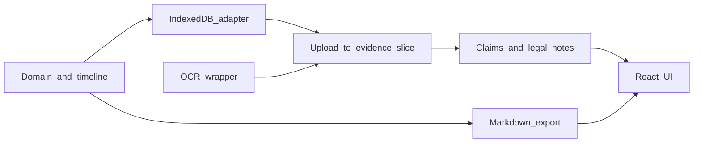

# TDD plan: Landlord Case Organizer MVP

## Principles (non-negotiable)

Follow red–green–refactor for every behavior: **write one failing test → run and confirm the failure is for the right reason → minimal production code → run all tests → refactor while green**. No production code without a prior failing test ([TDD skill](file:///C:/Users/Folma/.claude/plugins/cache/claude-plugins-official/superpowers/5.0.5/skills/test-driven-development/SKILL.md)).

Prefer **behavior-focused tests** on real modules (pure domain, storage adapter, export builder). Mock **only** boundaries that are slow or non-deterministic (e.g. Tesseract in unit tests); add one optional integration test with real Tesseract later if needed.

## MVP scope from spec (in test terms)

| MVP capability      | Primary test home                                          |
| ------------------- | ---------------------------------------------------------- |
| Upload documents    | File handling + persistence of blob metadata               |
| OCR text extraction | OCR service wrapper (mocked in unit; optional integration) |
| Tagging             | Evidence tags + optional rule-based category suggestion    |
| Timeline builder    | Pure function: evidence → sorted timeline events           |
| Legal notes         | CRUD + links to claims/evidence (domain + storage)         |
| Claim builder       | CRUD + relations to evidence/research                      |
| Export markdown     | Deterministic Markdown from fixture `Case` graphs          |

Defer (not in MVP list): PDF/HTML export, share link, GitHub sync, schema UI editor, full image cleanup pipeline—add tests only when you pull them into scope.

## Suggested repo layout (tests co-located or `__tests__`)

Align with the spec’s [File Structure](docs/specs/landlord_case_organizer_mvp_design_spec.md) and keep **domain + export + storage testable without the UI**:

- `app/domain/` — types, validation, timeline derivation, categorization helpers
- `app/storage/` — IndexedDB implementation behind a small interface
- `app/ocr/` — Tesseract wrapper
- `app/export/` — Markdown generators per export “shape”
- `app/components/`, `app/modules/` — React UI

Use **Vitest** + **@testing-library/react**; **fake-indexeddb** (or equivalent) for IndexedDB in Node. Optional **Playwright** for one happy-path flow after core slices are green.

## Implementation order (dependency-first)

Each phase is a sequence of **small tests** (one behavior per test name). Complete the full cycle per test before starting the next.

### Phase 0 — Test harness

- Add Vitest + RTL + jsdom; path aliases if needed.
- **First failing test**: e.g. `describe('domain smoke', () => { it('exports createEmptyCase', () => { ... }) })` so the runner is proven before domain work.

### Phase 1 — Domain model and timeline (pure, fast)

Cover structures from the spec: **Case**, **Evidence** (`id`, `type`, `date`, `tags`, extracted text, notes, source reference), **Claim** (title, description, related evidence, related law, strength, status), **Legal note** (topic, summary, source, applies-to-case, questions, confidence), **Lawyer** (for later UI; optional in MVP).

Example tests (names are the spec):

- Creating a case and adding evidence updates an immutable or explicit state object.
- **Timeline builder**: given evidence items with dates (and items without dates), output a **chronological** list with stable ordering for ties (e.g. by id).
- **Tagging**: add/remove tags; validate allowed shapes (non-empty id, etc.).

### Phase 2 — IndexedDB storage adapter

- Define a narrow interface (`loadCase`, `saveCase`, `addEvidence`, …) and test against **fake IndexedDB**.
- **RED**: persist then load; assert deep equality for domain graph.
- **GREEN**: minimal Dexie/raw IDB implementation (pick one; keep adapter thin).
- **Edge cases**: empty DB, corrupt payload (reject or migrate—test the chosen behavior).

### Phase 3 — OCR wrapper

- **RED**: mock `Tesseract.recognize` (or your wrapper) to return fixed text; assert the wrapper returns trimmed text and propagates errors.
- **GREEN**: thin module around Tesseract.js as per [Technical Stack](docs/specs/landlord_case_organizer_mvp_design_spec.md).

### Phase 4 — Upload → evidence slice (application service)

- **RED**: given a `File` (image), after “process”, evidence record contains `extractedText` from mocked OCR and a stable `sourceFile` id/name.
- **GREEN**: orchestration only (no UI): read file → call OCR → build evidence → pass to storage interface (inject mock storage in test).

### Phase 5 — Categorization / smart detection (MVP-simple)

Spec mentions **auto categorization** and examples (e.g. rent increase). Start with **rule-based** functions:

- **RED**: input string `"Rent will increase to $885"` → suggested category `Rent Increase` (or your enum).
- **GREEN**: keyword/regex table; extend with tests per category you support in MVP.

### Phase 6 — Claims and legal notes

- **Domain**: link claim ↔ evidence ids, legal note ↔ claim ids; invariants (e.g. cannot link missing id—define behavior).
- **Storage**: round-trip with links.
- Tests mirror [Legal Knowledge Organizer](docs/specs/landlord_case_organizer_mvp_design_spec.md) workflow steps as far as MVP requires.

### Phase 7 — Markdown export

- **RED**: fixture case with property, evidence list, timeline entries, claims, legal notes → snapshot or exact string match for **Full Case File** and at least one variant (**Timeline Only** or **Evidence Only**) from [Export System](docs/specs/landlord_case_organizer_mvp_design_spec.md).
- **GREEN**: pure functions in `app/export/`; no React.

### Phase 8 — React UI (RTL), mission-control layout

For each screen from [UI Layout](docs/specs/landlord_case_organizer_mvp_design_spec.md):

- **RED**: render with providers/fakes; assert labels, navigation, and that user actions call injected callbacks or context (e.g. “upload triggers `onUpload` with file”).
- **GREEN**: minimal components; avoid testing implementation details.
- **ADHD helpers** ([ADHD Support Features](docs/specs/landlord_case_organizer_mvp_design_spec.md)): test **progress** and **focus mode** as pure selectors/reducers first, then wire UI.

### Phase 9 — Optional Playwright

- One E2E: create case → upload (fixture file) → see evidence row with text (OCR mocked at build or stub server)—only after Phases 1–7 are stable.

## Completion checklist (from TDD discipline)

Before calling the MVP “done”:

- Every new function/module gained tests **that were observed failing** first.
- Domain, storage, OCR wrapper, export, and critical UI paths are covered.
- Mocks limited to I/O boundaries; assertions describe user-visible or contract behavior.
- Full test suite green with no ignored failures.

## Risk notes

- **OCR and image cleanup** are flaky/slow: keep them behind interfaces; unit tests use mocks; optional one manual or integration path.
- **IndexedDB in CI**: use `fake-indexeddb` or run browser tests in Playwright for storage if Node shim gaps appear.

